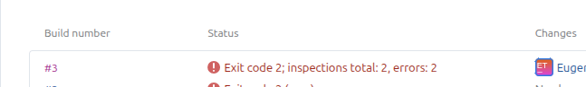
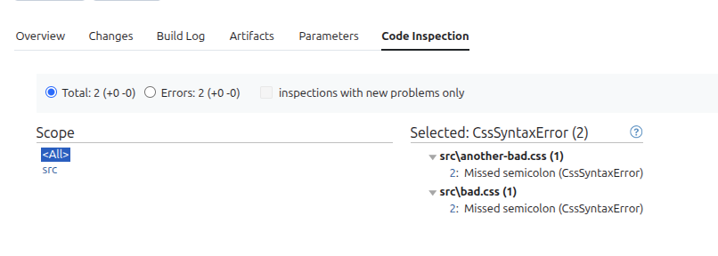

# stylelint-teamcity-formatter [](https://www.npmjs.com/package/stylelint-teamcity-formatter)


Formats [stylelint](http://stylelint.io/) errors for teamcity.




## Install

```
npm install stylelint-teamcity-formatter --save-dev
```

## Usage

For Stylelint 16 and newer:

```
stylelint <options> --custom-formatter stylelint-teamcity-formatter
```

For Stylelint 15 and older (legacy resolution):

```
stylelint <options> --custom-formatter node_modules/stylelint-teamcity-formatter
```

This formatter reports issues as TeamCity Inspections via service messages. See TeamCity docs: https://www.jetbrains.com/help/teamcity/service-messages.html#Reporting+Inspections

## Why use this formatter

- Native TeamCity Inspections integration via service messages: CSS/SCSS/Sass lint warnings and errors are reported as inspections with file, line, and severity.
- Faster CI/CD feedback: highlight style violations in the build status line and enforce quality gates with TeamCity build failure conditions (e.g., fail on any error or threshold).
- Works anywhere Stylelint runs: command line, npm scripts, or a TeamCity Command Line build step; good for monorepos and multi-project setups.
- Track trends and maintain audit trail: TeamCity aggregates inspection metrics across builds for visibility and continuous code quality.
- Zero-friction setup: add `--custom-formatter` and get structured, clickable findings in the TeamCity UI.

References:
- Stylelint CLI formatter option: https://stylelint.io/user-guide/cli/#--formatter--f----custom-formatter
- TeamCity Service Messages — Reporting Inspections: https://www.jetbrains.com/help/teamcity/service-messages.html#Reporting+Inspections
